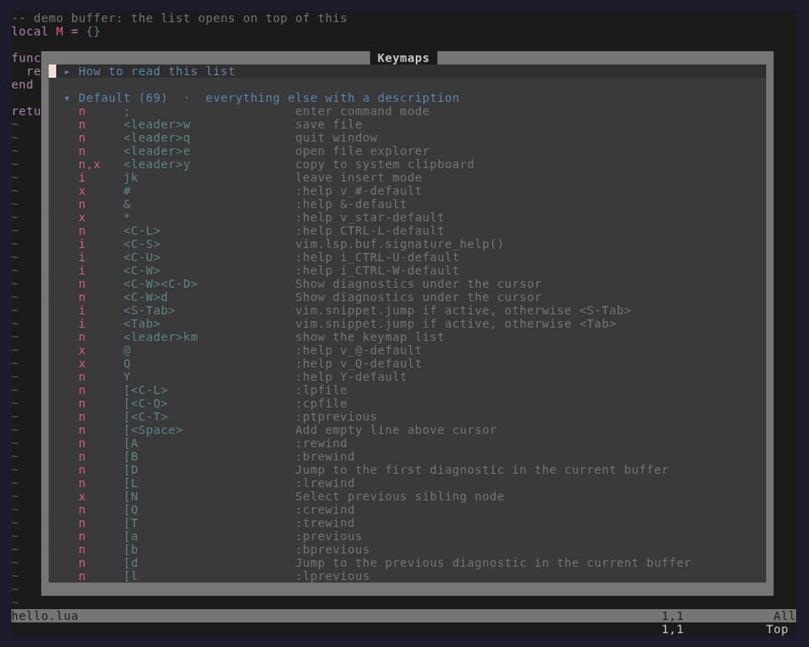
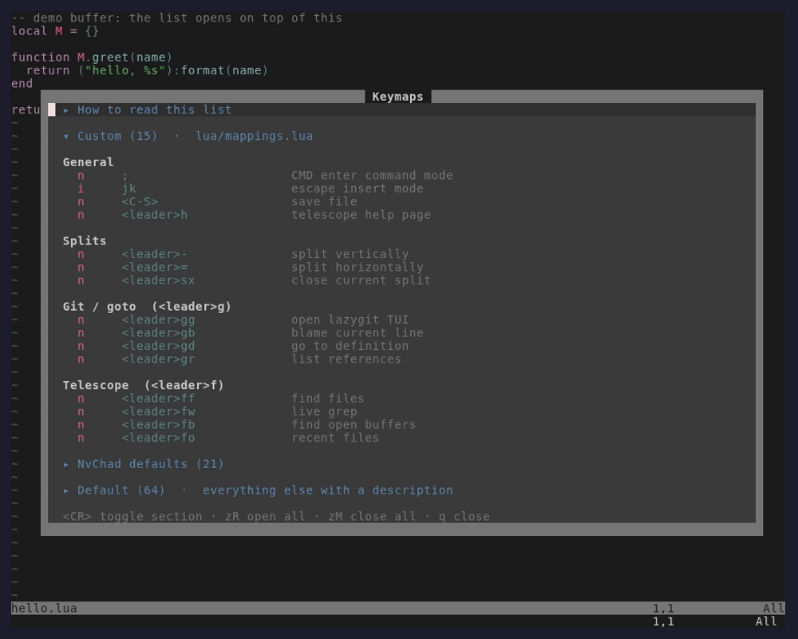
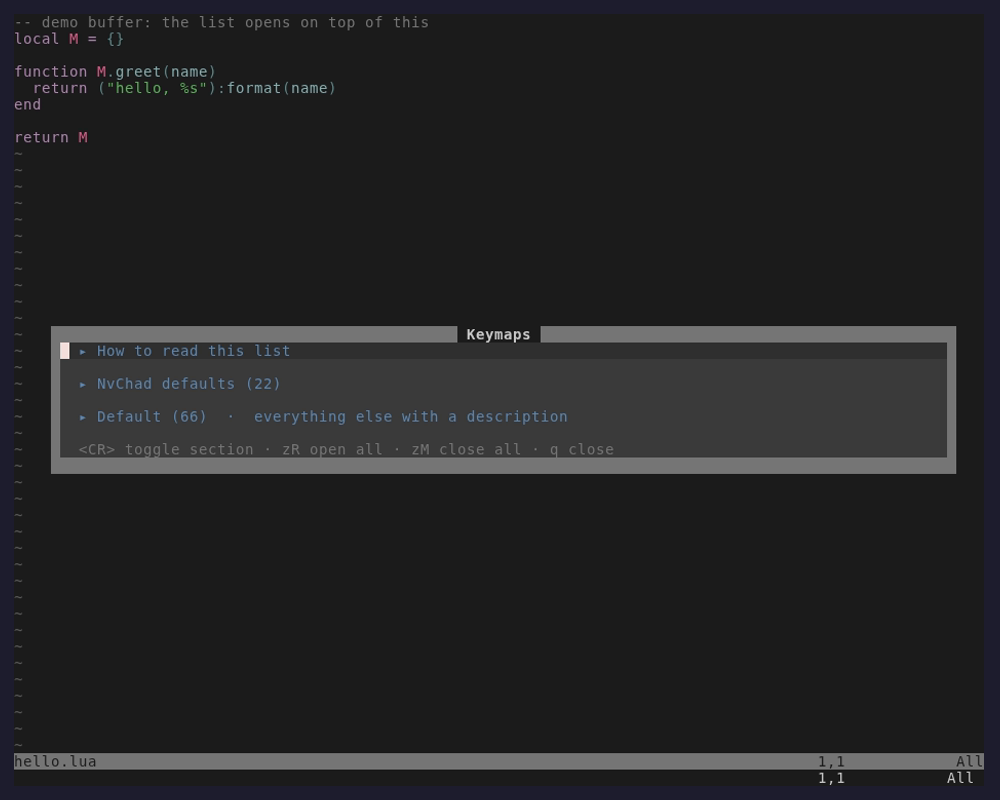
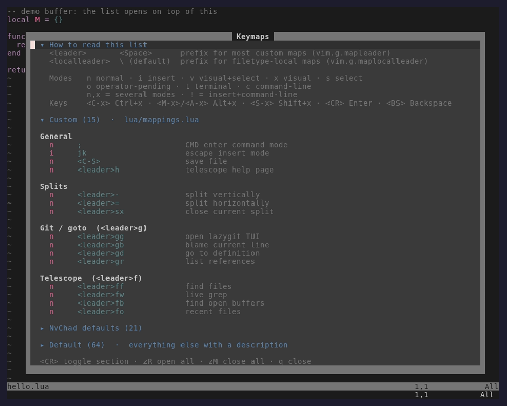

# keymap-helper.nvim

A grouped, collapsible list of your Neovim keymaps, opened with `<leader>km`. With no
configuration it lists every keymap that has a description. Add sections to split the list
by file, plugin, origin or pattern.



With a config like the NvChad example below, the list is split into your own groups and
NvChad's folded defaults:




On startup a small centered hint says which key opens the list. It closes on the first
keypress or after 6 seconds.

## Requirements

- Neovim >= 0.11
- Optional: [lazy.nvim](https://github.com/folke/lazy.nvim) (names the plugin behind lazy
  `keys` maps) and [which-key.nvim](https://github.com/folke/which-key.nvim) (names
  `<leader>x` groups when `group_by = "leader_prefix"`)

## Install

lazy.nvim. `VimEnter` loads it in time for the startup hint, and `cmd` covers the
command if you turn the hint off:

```lua
{
  "hosua/keymap-helper.nvim",
  cmd = { "KeymapHelper" },
  event = "VimEnter",
  opts = {},
}
```

That is all: `<leader>km` opens the list. Set `mapleader` before the plugin loads. To use
another key set `keymap = "<leader>?"`, or `keymap = false` to map your own (use a
`"<cmd>KeymapHelper<cr>"` string rather than a Lua function, so the startup hint can show
your key). A key you already mapped is never overwritten.

## Example: an NvChad config

The author's `lua/plugins/keymap-helper.lua`: custom maps first, grouped by the box comments
in `lua/mappings.lua`, then NvChad's own maps, folded.

```lua
return {
  {
    "hosua/keymap-helper.nvim",
    cmd = { "KeymapHelper" },
    event = "VimEnter",
    opts = {
      sections = {
        { title = "Custom", subtitle = "lua/mappings.lua", files = { "lua/mappings.lua" }, group_by = "header" },
        { title = "NvChad defaults", runtime_files = { "lua/nvchad/mappings.lua" }, collapsed = true },
      },
    },
  },
}
```

Everything those two sections do not claim lands in a folded "Default" section at the end,
so it does not need to be listed.

### How headers become groups

`group_by = "header"` reads the comments in the section's files. Every line that matches
`header_pattern` (default: `-- │ Name │`) starts a group, and the maps below it belong to
that group. The box's top and bottom lines are decoration. Part of that `lua/mappings.lua`:

```lua
require "nvchad.mappings"

local map = vim.keymap.set

-- ┌──────────────────────────────────────────┐
-- │ General                                  │
-- └──────────────────────────────────────────┘

map("n", ";", ":", { desc = "CMD enter command mode" })
map("n", "<leader>h", "<cmd>Telescope help_tags<CR>", { desc = "telescope help page" })

-- ┌──────────────────────────────────────────┐
-- │ Splits                                   │
-- └──────────────────────────────────────────┘

map("n", "<leader>-", "<cmd>vsp<CR>", { desc = "split vertically" })
map("n", "<leader>=", "<cmd>sp<CR>", { desc = "split horizontally" })

-- ┌──────────────────────────────────────────┐
-- │ Git / goto  (<leader>g)                  │
-- └──────────────────────────────────────────┘

map("n", "<leader>gg", "<cmd>LazyGit<CR>", { desc = "open lazygit TUI" })
map("n", "<leader>gb", "<cmd>Gitsigns blame<CR>", { desc = "blame current line" })
```

This shows as a "Custom" section with the groups "General", "Splits" and
"Git / goto  (<leader>g)" (see the screenshot above). A map that NvChad sets and this file overrides shows once, under
Custom. A NvChad map deleted with `vim.keymap.del` is not shown at all.

### Only want NvChad's maps split out?

One section is enough. Everything else stays in "Default":

```lua
opts = {
  sections = {
    { title = "NvChad defaults", runtime_files = { "lua/nvchad/mappings.lua" }, collapsed = true },
  },
}
```

`runtime_files` is looked up on `'runtimepath'`, so this path works for a stock NvChad
install. If your maps live elsewhere (for example `lua/custom/mappings.lua` or several
files), list those paths in a `files` section instead. `:checkhealth keymap-helper` says
whether each file was found.



## The legend

The list opens with a "How to read this list" section that resolves your real `<leader>`
and explains mode letters and key notation. Rows are coloured by role: mode, key, description.



## Commands

| Command | What it does |
|---|---|
| `:KeymapHelper` / `:KeymapHelper show` | Open the keymap list |
| `:KeymapHelper hint` | Show the startup hint again |
| `:KeymapHelper health` | Same as `:checkhealth keymap-helper` |

## Keys inside the list

| Key | Action |
|---|---|
| `<CR>`, `za`, `<Tab>` | Toggle the section under the cursor |
| `l` / `h` | Open / close the section under the cursor |
| `zR` / `zM` | Open / close every section (the intro too) |
| Left click on a section header | Toggle it (any other click works as normal) |
| `q`, `<Esc>` | Close |

## How maps are sorted into sections

Each map goes to the **first** section whose matchers all pass. Sections with `rest = true` are
tried last. A map's origin is worked out from, in order:

1. `track()`, if you turned it on (see below): the exact file that called `vim.keymap.set`.
2. lazy.nvim `keys` specs: the plugin that declared the key.
3. The file a Lua callback was defined in (`map("n", "x", function() ... end)`).
4. Neovim's script id, but only when it carries a line number. During normal startup every
   Lua-set map reports `init.lua` with line 0, which says nothing about the real file.
5. A text scan of your config's `*.lua` files for `map(...)` / `vim.keymap.set(...)` calls.
   This is how string-rhs maps such as `"<cmd>w<cr>"` get placed.
6. Neovim's own defaults (`:help Y-default` style descriptions, `$VIMRUNTIME` files).

Rows always come from what is **live** right now, so a map you deleted with `vim.keymap.del`
is not listed, even when it is still in some plugin's mappings file. Maps with no `desc` and
`<Plug>` maps are hidden (set `show_undocumented = true`), except maps that a `files` section
claims: those show even without a description.

String-rhs maps set by plugins have no recorded origin, so they land in the "Default" (rest)
section unless you use `track()` or give that plugin a `runtime_files` section.

## Configuration

Every option, with its default:

<!-- defaults:start -->
```lua
require("keymap-helper").setup {
  sections = {
    { title = "Default", subtitle = "everything else with a description", rest = true, collapsed = false },
  },
  -- Normal-mode key that opens the list, or false for none. A key you already
  -- mapped is never overwritten.
  keymap = "<leader>km",
  -- Show maps with no desc and <Plug> maps (file sections always show their own).
  show_undocumented = false,
  detect = {
    scan_config = true, -- text-scan stdpath("config") *.lua to place string-rhs maps
    max_files = 200, -- stop scanning after this many files (health warns)
    lazy_keys = true, -- read lazy.nvim `keys` specs for plugin names
    which_key = true, -- name <leader>x groups after which-key groups, if loaded
  },
  -- Lua pattern for a section header comment; capture 1 is the header text.
  -- The default matches `-- │ General │` box-drawing headers.
  header_pattern = "^%-%- │%s*(.-)%s*│$",
  -- Function names treated as "set a mapping" when scanning files.
  map_functions = { "map", "vim.keymap.set", "keymap.set" },
  -- Modes whose live mappings are listed (plus any mode a `files` section sets).
  modes = { "n", "i", "v", "x", "t" },
  window = {
    title = " Keymaps ",
    max_width = 96,
  },
  hint = {
    enabled = true,
    -- `{key}` becomes the key you mapped to :KeymapHelper, or the command itself.
    message = "Type {key} to view a list of all keymappings!",
    timeout_ms = 6000,
    -- "center" or "bottom_right".
    position = "center",
  },
  -- Short "how to read this list" header (leader keys, mode letters).
  intro = { enabled = true, collapsed = false },
}
```
<!-- defaults:end -->

`sections`, `modes` and `map_functions` replace the defaults outright; every other table
merges key by key. Unknown keys (including misspelled section keys such as `colapsed`) are
reported with a warning.

### Section keys

| Key | Type | Meaning |
|---|---|---|
| `title` | string, required | Section header |
| `subtitle` | string | Dimmed text after the title |
| `config` | boolean | Maps set by your config (`stdpath("config")`) |
| `builtin` | boolean | Maps set by Neovim itself |
| `plugin` | `true`, name, or list of names | Maps set by any plugin, or the named ones (case-insensitive, `.nvim` optional) |
| `files` | string[] | Maps set in these files (relative paths resolve against `stdpath("config")`). Supplies header groups and file order |
| `runtime_files` | string[] | Like `files`, looked up on `'runtimepath'`, e.g. `"lua/nvchad/mappings.lua"` |
| `lhs` / `desc` | Lua pattern | Match the displayed lhs (`<leader>gb`) / the desc |
| `mode` | string or string[] | Only these modes |
| `fn` | `function(map, origin) -> boolean` | Custom matcher. `origin.kind` is `config`, `plugin`, `builtin` or `unknown`; `origin.plugin`, `origin.file` when known |
| `rest` | boolean | Fallback: takes whatever no other section matched |
| `group_by` | `"header"`, `"plugin"`, `"leader_prefix"`, `"none"` | Sub-groups. `header` uses `-- │ Name │` comments in the files, `leader_prefix` groups by `<leader>x` |
| `collapsed` | boolean | Start folded |
| `hidden` | boolean | Claim the maps but do not show the section (to suppress noise) |

All matcher keys in one section must pass. If no section has `rest = true`, unmatched maps
go to a folded "Default" section added at the end, which only appears when it has rows. To
drop them instead, add `{ title = "rest", rest = true, hidden = true }`.

### Recipes

Split by origin (your config, each plugin, Neovim itself):

```lua
opts = {
  sections = {
    { title = "Your config", config = true, group_by = "header" },
    { title = "Plugins", plugin = true, group_by = "plugin", collapsed = true },
    { title = "Neovim defaults", builtin = true, collapsed = true },
    { title = "Other", subtitle = "origin unknown", rest = true, collapsed = true },
  },
}
```

LazyVim: add this to your sections:

```lua
{ title = "LazyVim", runtime_files = { "lua/lazyvim/config/keymaps.lua" }, group_by = "leader_prefix", collapsed = true },
```

Filters:

```lua
{ title = "Git", lhs = "^<leader>g" },
{ title = "Terminal", mode = "t" },
{ title = "Mine", fn = function(map, origin) return origin.kind == "config" end },
{ title = "noise", plugin = "some-plugin", hidden = true },
```

### `track()`: exact origins for every map

Optional. It wraps `vim.keymap.set` so each map records the file that set it, which places
string-rhs maps from plugins correctly too. It must run **before** anything sets maps, so put
it at the very top of `init.lua`, before lazy.nvim loads. The plugin is not on the
runtimepath yet at that point, so add it by hand:

```lua
local kh = vim.fn.stdpath "data" .. "/lazy/keymap-helper.nvim"
if vim.uv.fs_stat(kh) then
  vim.opt.rtp:prepend(kh)
  require("keymap-helper").track()
end
```

`:checkhealth keymap-helper` then shows `track() active: N maps recorded`. To undo it,
delete the block. Maps set through `vim.api.nvim_set_keymap`, or before `track()` runs,
fall back to the other detection layers.

## Highlight groups

All are linked with `default = true`, so your theme or `nvim_set_hl` overrides them.

| Group | Default link |
|---|---|
| `KeymapHelperSection` | `Type` |
| `KeymapHelperGroup` | `Title` |
| `KeymapHelperMode` | `Constant` |
| `KeymapHelperKey` | `Special` |
| `KeymapHelperDesc` | `Comment` |
| `KeymapHelperIntro` | `Comment` |
| `KeymapHelperFooter` | `Comment` |
| `KeymapHelperHintBorder` | `DiagnosticInfo` |

## Data on disk

None. The plugin reads your config files and Neovim's live keymaps, and writes nothing.

## Troubleshooting

`:checkhealth keymap-helper` shows which copy of the plugin is loaded, whether each section's
`files` were found, how many maps each detection layer explained, and the first maps with no
known origin.

- **A plugin's maps are under "Default"**: they are string-rhs maps with no recorded origin.
  Use `track()` or add `{ title = "...", runtime_files = { "lua/<plugin>/mappings.lua" } }`.
- **`<leader>km` does nothing**: `:checkhealth keymap-helper` shows the key in use. The
  plugin does not overwrite a key you mapped yourself, and with lazy.nvim the key exists only
  once the plugin has loaded (`event = "VimEnter"`).
- **My maps show no groups**: `group_by = "header"` needs comments matching `header_pattern`
  (default `-- │ Name │`). Without them, use `group_by = "leader_prefix"`.
- **Maps set in an `LspAttach` autocmd are missing**: they are buffer-local, and the list only
  shows global maps.

## Development

```bash
make test         # headless unit tests, no dependencies, throwaway XDG tree
make integration  # end-to-end detection against a fake config and fake plugins
make smoke        # real TUI in a private tmux server: hint, list, folding, mouse
make check        # stylua --check
```

## License

MIT
